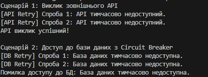

# Звіт по кейсам Polly/Retry у .NET

## Мета
Дослідити використання бібліотеки **Polly** для реалізації політик відмовостійкості (Retry, Circuit Breaker, Timeout) у .NET-застосунках.  
Навчитися імітувати помилки та обробляти їх за допомогою політик Polly.

---

## Сценарій 1: Виклик зовнішнього API

### Проблема
Зовнішній API може тимчасово бути недоступним (наприклад, 503 Service Unavailable). Повторні запити необхідно здійснювати перед остаточною відмовою.

### Обґрунтування вибору політики
Використовується політика **Retry**:
- Для повторних спроб при тимчасових помилках.
- Логування кожної спроби для контролю процесу.

## Сценарій 2: Доступ до бази даних з Circuit Breaker

### Проблема
База даних може тимчасово відмовляти при підключенні. Надмірні повторні запити можуть перевантажити систему.

### Обґрунтування вибору політики
Використовується комбінація **Retry + Circuit Breaker**:
- Retry: повторні спроби на випадок тимчасових помилок.
- Circuit Breaker: блокує надмірні виклики після кількох невдач, захищаючи систему.

### Загальні висновки
- Polly дозволяє ефективно реалізувати політики відмовостійкості в .NET-застосунках.
- Retry допомагає автоматично повторювати операції при тимчасових помилках.
- Circuit Breaker захищає систему від надмірного навантаження під час повторних невдач.
- Timeout (не показаний) дозволяє обмежити час виконання операцій, запобігаючи зависанням.
- Комбінація політик Polly забезпечує надійну і керовану поведінку при помилках зовнішніх ресурсів.

### Приклад запуску програми
