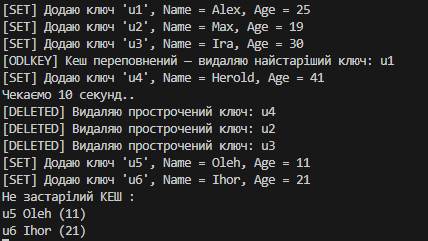

# Cамостійна робота №1 (Generics)

### Опис проєкту
Метою проекту є реалізація універсального кеша (Cache<T>) для зберігання об’єктів з обмеженням по кількості та часом життя (TTL). 
### Кеш дозволяє:
- Зберігати будь-які об’єкти (class) завдяки використанню дженериків (generics).
- Видаляти старі або прострочені елементи автоматично.
- Сортувати об’єкти за обраним критерієм без використання LINQ.
- Логувати усі дії (додавання, видалення старих елементів, переповнення).
### Особливості реалізації:
- Використання generics (Cache<T>) дозволяє кешувати будь-які типи об’єктів класу.
- Алгоритм видалення старих елементів:
- TTL — елементи старші ніж Ttl видаляються автоматично при додаванні нового.
- Переповнення кеша — видаляється найстаріший елемент.
- Сортування без LINQ:
- Використано Insertion Sort для відсортованого виведення елементів.
- Логування у консоль:
- Додається [SET] Key, Name, Age
- Видаляється [DELETED] Key при TTL
- Видаляється [ODLKEY] Key при переповненні
  
### Приклад запуску програми

