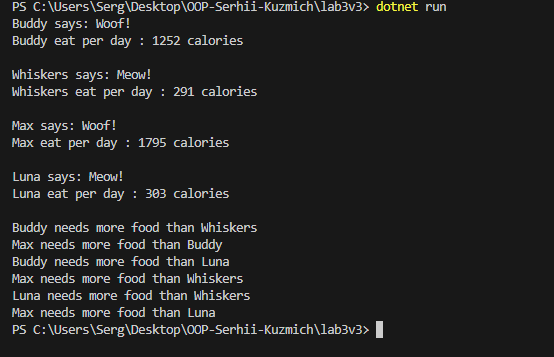

# Lab3v3 (Animal Calorie Calculator)

## Тема : 
Наслідування: основи
## Мета :
Закріпити знання про базові класи, похідні класи, модифікатори доступу, використання base, поліморфізм у простій формі.

## Опис проєкту
Цей проєкт на C# дозволяє розраховувати денне споживання калорій для тварин (собак і котів) на основі їх ваги та коефіцієнта активності.  
Використовується поліморфізм: базовий клас `Animal` і похідні класи `Dog` та `Cat`.  
Також можна зберігати декілька тварин у колекції і порівнювати їх споживання калорій.

### Основні функції:
- Розрахунок калорій за формулою RER/MER.
- Визначення, хто з тварин їсть більше.
- Використання поліморфізму для обробки колекції об’єктів `Animal`.
- Методи `Speak()` для кожної тварини.

### Приклад запуску програми
