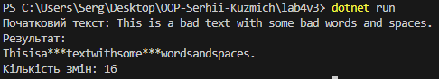

# Лабораторна робота №4v3 (Text edit)

### Тема : Абстракції та інтерфейси. Композиція та агрегація.
### Мета : Навчитися створювати абстрактні класи та інтерфейси, будувати ієрархії класів із використанням композиції та агрегації, реалізовувати прості обчислення, демонструвати гнучкість і повторне використання коду.

### Опис проєкту
Проєкт дозволяє застосовувати до тексту кілька різних фільтрів, таких як:
- Видалення пробілів.
- Заміна заборонених слів на зірочки.
  
Кожен фільтр реалізує базовий інтерфейс ITextFilter та успадковується від абстрактного класу TextFilterBase. Програма підраховує кількість змін, внесених кожним фільтром, а також загальну кількість змін. Фільтри застосовуються послідовно за допомогою композиції через клас TextProcessor.

### Основні функції:
- Інтерфейс ITextFilter:
  * Метод ActionByText(string text) — застосування фільтру до тексту.
  * Властивість ChangesCount — зберігає кількість змін, зроблених фільтром.
- Абстрактний клас TextFilterBase:
  * Є базовим класом для всіх фільтрів.
  * Містить спільну логіку або поле для підрахунку змін (ChangesCount).
- Конкретні реалізації фільтрів:
  * RemoveSpacesFilter — видаляє всі пробіли з тексту, підраховує кількість видалених пробілів.
  * CensorWordsFilter — замінює заборонені слова на зірочки, підраховує кількість замін.
- Клас Text:
  * Використовує композицію для роботи з фільтрами.
  * Застосовує фільтри один за одним до вхідного тексту.
  * Обчислює загальну кількість змін, внесених усіма фільтрами.

### Приклад запуску програми

