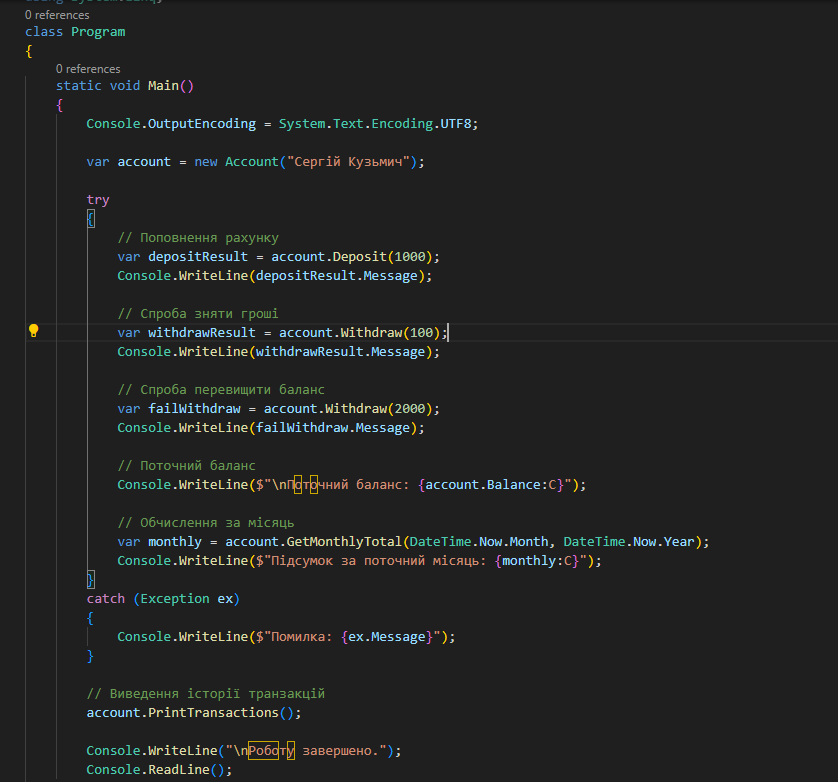
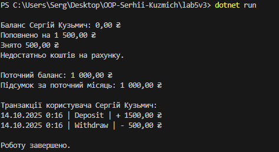

# Лабораторна робота №5v3 (Account/Transaction)

### Тема : Узагальнені типи (Generics), колекції і LINQ, обробка винятків.
### Мета : Навчитися створювати узагальнені класи/методи, працювати з колекціями та LINQ, коректно валідувати вхідні дані і створювати/обробляти винятки.

### Опис проєкту
Проєкт моделює роботу банківського рахунку користувача.
Проєкт демонструє основи об’єктно-орієнтованого програмування (класи, композиція, узагальнення, винятки), роботу з колекціями та обчисленнями.
- Основні сутності
- Account (Рахунок)
  * Представляє банківський рахунок користувача.
  * Містить список транзакцій (композиція) та поточний баланс.
- Transaction (Транзакція)
  * Описує одну операцію над рахунком (поповнення або зняття).
- Result<T> (Узагальнений результат)
  * Узагальнений клас для повернення результатів операцій із інформацією про успіх чи помилку.
- Власні винятки:
  * InvalidAmountException — якщо введено некоректну суму.
  * InsufficientFundsException — якщо на рахунку недостатньо коштів для зняття.
### Основні функції:
Створення банківського рахунку користувача.
- Поповнення балансу на вказану суму.
- Зняття коштів із перевіркою достатності балансу.
- Виведення історії транзакцій.
- Обчислення балансу станом на кінець вибраного місяця.
- Обробка винятків через try-catch.
- Узагальнені класи Result<T> і Repository<T>.

### Приклад запуску програми

### Контрольні питання
- Що таке generics? Які їхні переваги?
  
  Generics, узагальнення - це механізм, який дозволяє створювати класи, методи або інтерфейси, параметризовані типом.
  Наприклад, замість того щоб робити окремий клас для int, string чи Account, можна написати один узагальнений клас Repository<T> або метод Result<T> і використовувати його з будь-яким типом T.
- Які основні відмінності між ArrayList і List<T>?

  ArrayList зберігає елементи як object, тому для конкретних типів потрібен кастинг, немає перевірки типів на компіляції, і для значимих типів відбувається boxing/unboxing, що знижує продуктивність. List<T> - це узагальнений список, типобезпечний, перевіряє типи на компіляції, працює ефективніше і підтримує будь-який конкретний тип T. Через це зараз зазвичай використовують List<T>, а ArrayList вважається застарілим.
- Чим відрізняється Dictionary<TKey,TValue> від List<T>?
  
  Dictionary<TKey, TValue> зберігає дані у вигляді пар ключ–значення і дозволяє швидко знаходити елемент за ключем, тоді як List<T> - це впорядкований список елементів одного типу без ключів, де доступ здійснюється за індексом. Dictionary оптимізований для швидкого пошуку, а List - для перебору та збереження порядку додавання.
- У чому перевага LINQ над класичними циклами?
  
  LINQ дозволяє писати короткий, зрозумілий і декларативний код для роботи з колекціями, без явних циклів і умов.
- Як працює ключове слово finally?
  
  Ключове слово finally використовується разом із блоками try-catch і завжди виконується, незалежно від того, виникла помилка чи ні.
  Його основне призначення - очищення ресурсів (закриття файлів, звільнення пам’яті, закриття підключень тощо), щоб гарантовано виконати важливий код після спроби виконати блок try.
- Коли доцільно створювати власні класи винятків?
  
  Власні класи винятків доцільно створювати, коли потрібно точно описати специфічну помилку програми, яку не охоплюють стандартні винятки.
