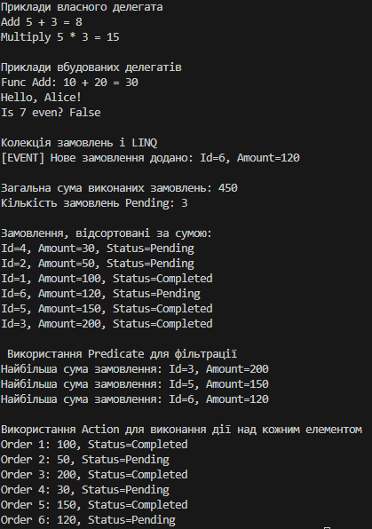

# Лабораторна робота №6v3 (Делегати, події та LINQ в C#)

### Опис проєкту
Цей проект демонструє використання **делегатів, подій, анонімних методів, лямбда-виразів та вбудованих делегатів** (`Func<>`, `Action<>`, `Predicate<>`) у C#.  
Також проект містить приклад обробки колекції об’єктів за допомогою **LINQ-операцій** (`Where`, `Select`, `OrderBy`, `Aggregate`) та лямбда-виразів.

## Особливості проекту
- **Власний делегат** `MathOperation` для арифметичних операцій з прикладами:
  - Лямбда-вираз
  - Анонімний метод
- **Вбудовані делегати:**
  - `Func<int,int,int>` — додавання чисел
  - `Action<string>` — вивід повідомлення в консоль
  - `Predicate<int>` — перевірка числа на парність
- **Подія** `OnNewOrder` з делегатом `Action<Order>` для сповіщення про нове замовлення
- **Колекція `List<Order>`**:
  - Об’єкти `Order` мають поля: `Id`, `Amount`, `Status`
  - Лямбда-вирази використовуються для:
    - Підрахунку загальної суми виконаних замовлень (`Aggregate`)
    - Підрахунку кількості замовлень зі статусом `Pending` (`Count`)
    - Сортування за сумою (`OrderBy`)
  - Використання `Predicate` для фільтрації замовлень
  - Використання `Action` для виконання дій над колекцією (`ForEach`)
  
### Приклад запуску програми
