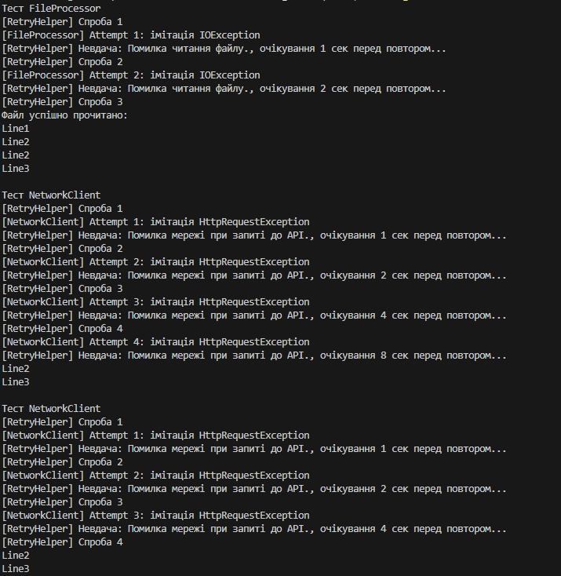

# Лабораторна робота №7v3 (Сценарій: Запит до API)

### Опис проєкту
Цей проект демонструє:

- Обробку помилок вводу/виводу (`IOException`, `FileNotFoundException`) та мережевих помилок (`HttpRequestException`) за допомогою блоків `try-catch-finally`.
- Реалізацію **патерну Retry** для підвищення відмовостійкості застосунків.
- Використання узагальненого класу `RetryHelper` для повторних спроб виконання операцій з експоненційною затримкою.
- Вибіркове повторення операцій через делегат `shouldRetry`.

## Особливості проекту

1. **FileProcessor**
   - Імітує роботу з файлами.
   - Метод `List<string> GetLines(string path)` може викидати `IOException` або `FileNotFoundException`.
   - Демонструє повторні спроби при тимчасових помилках файлу.

2. **NetworkClient**
   - Імітує мережеві запити.
   - Метод `string GetApiResponse(string endpoint)` може викидати `HttpRequestException`.
   - Демонструє повторні спроби при тимчасових мережевих помилках.

3. **RetryHelper**
   - Узагальнений статичний клас для повторних спроб виконання операцій.
   - Метод `ExecuteWithRetry<T>` приймає:
     - `operation`: делегат `Func<T>`, що виконує операцію.
     - `retryCount`: максимальна кількість спроб.
     - `initialDelay`: початкова затримка для експоненційного збільшення.
     - `shouldRetry`: делегат для вибіркового повторення помилок.
   - Логування кожної спроби та причини невдачі.
   - Реалізація експоненційної затримки: `initialDelay * 2^retryAttempt`.
### Відповіді на запитання

- Типи винятків: IOException, FileNotFoundException, HttpRequestException
- Принцип Retry: повторне виконання операції при помилках; використовується для тимчасових збоїв (файл заблоковано, мережа тимчасово недоступна)
- Експоненційна затримка: delay = initialDelay * 2^retryAttempt
- shouldRetry: визначає, чи слід повторювати спробу для конкретного винятку

### Вивід запуску програми

Тест FileProcessor
[RetryHelper] Спроба 1
[FileProcessor] Attempt 1: імітація IOException
[RetryHelper] Невдача: Помилка читання файлу., очікування 1 сек перед повтором...
[RetryHelper] Спроба 2
[FileProcessor] Attempt 2: імітація IOException
[RetryHelper] Невдача: Помилка читання файлу., очікування 2 сек перед повтором...
[RetryHelper] Спроба 3
Файл успішно прочитано:
Line1
Line2
Line2
Line3

Тест NetworkClient
[RetryHelper] Спроба 1
[NetworkClient] Attempt 1: імітація HttpRequestException
[RetryHelper] Невдача: Помилка мережі при запиті до API., очікування 1 сек перед повтором...
[RetryHelper] Спроба 2
[NetworkClient] Attempt 2: імітація HttpRequestException
[RetryHelper] Невдача: Помилка мережі при запиті до API., очікування 2 сек перед повтором...
[RetryHelper] Спроба 3
[NetworkClient] Attempt 3: імітація HttpRequestException
[RetryHelper] Невдача: Помилка мережі при запиті до API., очікування 4 сек перед повтором...
[RetryHelper] Спроба 4
[NetworkClient] Attempt 4: імітація HttpRequestException
[RetryHelper] Невдача: Помилка мережі при запиті до API., очікування 8 сек перед повтором...
Line2
Line3

Тест NetworkClient
[RetryHelper] Спроба 1
[NetworkClient] Attempt 1: імітація HttpRequestException
[RetryHelper] Невдача: Помилка мережі при запиті до API., очікування 1 сек перед повтором...
[RetryHelper] Спроба 2
[NetworkClient] Attempt 2: імітація HttpRequestException
[RetryHelper] Невдача: Помилка мережі при запиті до API., очікування 2 сек перед повтором...
[RetryHelper] Спроба 3
[NetworkClient] Attempt 3: імітація HttpRequestException
[RetryHelper] Невдача: Помилка мережі при запиті до API., очікування 4 сек перед повтором...
[RetryHelper] Спроба 4
Line2
Line3

Тест NetworkClient
[RetryHelper] Спроба 1
[NetworkClient] Attempt 1: імітація HttpRequestException
[RetryHelper] Невдача: Помилка мережі при запиті до API., очікування 1 сек перед повтором...
[RetryHelper] Спроба 2
[NetworkClient] Attempt 2: імітація HttpRequestException
[RetryHelper] Невдача: Помилка мережі при запиті до API., очікування 2 сек перед повтором...
[RetryHelper] Спроба 3
[NetworkClient] Attempt 3: імітація HttpRequestException
Line2
Line3

Тест NetworkClient
[RetryHelper] Спроба 1
[NetworkClient] Attempt 1: імітація HttpRequestException
[RetryHelper] Невдача: Помилка мережі при запиті до API., очікування 1 сек перед повтором...
[RetryHelper] Спроба 2
[NetworkClient] Attempt 2: імітація HttpRequestException
[RetryHelper] Невдача: Помилка мережі при запиті до API., очікування 2 сек перед повтором...
Line2
Line3

Тест NetworkClient
[RetryHelper] Спроба 1
[NetworkClient] Attempt 1: імітація HttpRequestException
[RetryHelper] Невдача: Помилка мережі при запиті до API., очікування 1 сек перед повтором...
[RetryHelper] Спроба 2
Line2
Line3

Тест NetworkClient
[RetryHelper] Спроба 1
[NetworkClient] Attempt 1: імітація HttpRequestException
Line2
Line3

Тест NetworkClient
Line2
Line3
Line3

Тест NetworkClient
[RetryHelper] Спроба 1
[RetryHelper] Спроба 1
[NetworkClient] Attempt 1: імітація HttpRequestException
[NetworkClient] Attempt 1: імітація HttpRequestException
[RetryHelper] Невдача: Помилка мережі при запиті до API., очікування 1 сек перед повтором...
[RetryHelper] Спроба 2
[NetworkClient] Attempt 2: імітація HttpRequestException
[RetryHelper] Невдача: Помилка мережі при запиті до API., очікування 2 сек перед повтором...
[RetryHelper] Спроба 3
[NetworkClient] Attempt 3: імітація HttpRequestException
[RetryHelper] Невдача: Помилка мережі при запиті до API., очікування 4 сек перед повтором...
[RetryHelper] Спроба 4
[NetworkClient] Attempt 4: імітація HttpRequestException
[RetryHelper] Спроба 2
[NetworkClient] Attempt 2: імітація HttpRequestException
[RetryHelper] Невдача: Помилка мережі при запиті до API., очікування 2 сек перед повтором...
[RetryHelper] Спроба 3
[NetworkClient] Attempt 3: імітація HttpRequestException
[RetryHelper] Невдача: Помилка мережі при запиті до API., очікування 4 сек перед повтором...
[RetryHelper] Спроба 4
[RetryHelper] Спроба 2
[NetworkClient] Attempt 2: імітація HttpRequestException
[RetryHelper] Невдача: Помилка мережі при запиті до API., очікування 2 сек перед повтором...
[RetryHelper] Спроба 3
[NetworkClient] Attempt 3: імітація HttpRequestException
[RetryHelper] Спроба 2
[NetworkClient] Attempt 2: імітація HttpRequestException
[RetryHelper] Невдача: Помилка мережі при запиті до API., очікування 2 сек перед повтором...
[RetryHelper] Спроба 2
[RetryHelper] Спроба 2
[NetworkClient] Attempt 2: імітація HttpRequestException
[RetryHelper] Невдача: Помилка мережі при запиті до API., очікування 2 сек перед повтором...
[RetryHelper] Спроба 2
[NetworkClient] Attempt 2: імітація HttpRequestException
[RetryHelper] Спроба 2
[NetworkClient] Attempt 2: імітація HttpRequestException
[RetryHelper] Спроба 2
[NetworkClient] Attempt 2: імітація HttpRequestException
[RetryHelper] Невдача: Помилка мережі при запиті до API., очікування 2 сек перед повтором...
[RetryHelper] Спроба 3
[NetworkClient] Attempt 3: імітація HttpRequestException
[RetryHelper] Невдача: Помилка мережі при запиті до API., очікування 4 сек перед повтором...
[RetryHelper] Спроба 4
[RetryHelper] Спроба 2
[NetworkClient] Attempt 2: імітація HttpRequestException
[RetryHelper] Невдача: Помилка мережі при запиті до API., очікування 2 сек перед повтором...
[RetryHelper] Спроба 3
[NetworkClient] Attempt 3: імітація HttpRequestException
[RetryHelper] Невдача: Помилка мережі при запиті до API., очікування 4 сек перед повтором...
[RetryHelper] Спроба 4
[RetryHelper] Спроба 2
[NetworkClient] Attempt 2: імітація HttpRequestException
[RetryHelper] Невдача: Помилка мережі при запиті до API., очікування 2 сек перед повтором...
[RetryHelper] Спроба 3
[NetworkClient] Attempt 3: імітація HttpRequestException
[RetryHelper] Спроба 2
[NetworkClient] Attempt 2: імітація HttpRequestException
[RetryHelper] Невдача: Помилка мережі при запиті до API., очікування 2 сек перед повтором...
[RetryHelper] Спроба 2
[NetworkClient] Attempt 2: імітація HttpRequestException
[RetryHelper] Спроба 2
[RetryHelper] Спроба 2
[RetryHelper] Спроба 2
[NetworkClient] Attempt 2: імітація HttpRequestException
[RetryHelper] Невдача: Помилка мережі при запиті до API., очікування 2 сек перед повтором...
[RetryHelper] Спроба 3
[NetworkClient] Attempt 3: імітація HttpRequestException
[RetryHelper] Невдача: Помилка мережі при запиті до API., очікування 4 сек перед повтором...
[RetryHelper] Спроба 4
[NetworkClient] Attempt 4: імітація HttpRequestException
[RetryHelper] Невдача: Помилка мережі при запиті до API., очікування 8 сек перед повтором...
[RetryHelper] Спроба 5
API відповів: Response from https://fakeapi.com/data